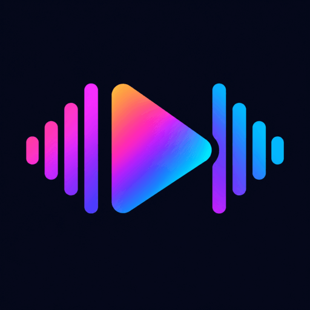

# VibeAmp — Native macOS Edition

<p align="center">
  
</p>

Retro Winamp-inspired YouTube music player, rebuilt as a **fully native macOS app** in Swift (SwiftUI + AppKit + AVFoundation). No Electron, no Chromium, no web views, no JavaScript — one shared Swift state observed by seven independent retro modules plus a modern menu-bar mini player.

> “What if Winamp had been rebuilt specifically for modern macOS?”

Original Electron reference: https://github.com/jsoriase/vibeamp (treated as product spec, not ported code).

## Features

- YouTube search (debounced, stale-guarded), video URLs, youtu.be, playlist URLs
- Streaming audio via managed `yt-dlp` (no ffmpeg, no downloads)
- Playback queue with reorder, highlight, persistence, auto-advance
- 10-band EQ + preamp (−12…+12 dB) with **genuine DSP** via `MTAudioProcessingTap`
- Seven modular windows: Player, Equalizer, Queue, Playlists, Search, Album Art, Log
- Custom Winamp-style title bars (drag / minimize / shade / hide)
- Window snapping + docking (15 px, screen edges + other modules, attachment graph)
- Layout persistence with on-screen validation
- macOS menu-bar mini player (native surface, not retro-skinned)
- Control Center / Now Playing + media-key integration
- Diagnostic LOG window (info / warning / error, capped at 200)

## Requirements

- macOS 15+ (Sequoia or later)
- Xcode 26+ (Swift 6.3 toolchain, Swift 5 language mode)
- Network access for YouTube + yt-dlp download on first run

## Build & Run

```bash
# Open in Xcode
open VibeAmp.xcodeproj

# Or build from the terminal
xcodebuild -project VibeAmp.xcodeproj -scheme VibeAmp -configuration Debug build

# Run tests
xcodebuild test -project VibeAmp.xcodeproj -scheme VibeAmp -destination 'platform=macOS'
```

The app bundle lands in DerivedData (`.../Build/Products/Debug/VibeAmp.app`). For local distribution, archive in Xcode and ad-hoc sign (`CODE_SIGN_IDENTITY = "-"` is already configured for direct distribution, no sandbox).

## yt-dlp Management

Stored at:

```
~/Library/Application Support/VibeAmp/bin/yt-dlp
```

On first launch (`YTDLPManager.ensure`):

1. Creates directories safely
2. Downloads `https://github.com/yt-dlp/yt-dlp/releases/latest/download/yt-dlp_macos`
3. Writes to `.download` temp, validates ≥1 MB + HTTP 2xx
4. Atomically moves into place, `chmod 755`
5. Reports progress/errors to `AppLog` (LOG window)

All invocations use `Foundation.Process` directly — **never `bash -c`**, every argument passed separately. Search/stream/playlist calls are async actors with cancellation; stale search results never overwrite newer ones.

Stream resolution prefers AVFoundation-compatible audio:

```
bestaudio[ext=m4a]/bestaudio[acodec^=mp4a]/bestaudio/best
```

Parsed from lightweight `--print url/ext/acodec/abr/asr` output (~1 KB instead of `--dump-json`'s ~600 KB). CDN URLs expire and are **never persisted** — only video ID / YouTube URL is stored.

### Load-time performance (measured)

Resolving a fresh song costs ~10–12 s, almost entirely inside yt-dlp's YouTube extraction. This got slower over 2025–2026 on YouTube's side, not ours: since yt-dlp 2025.11.12, full YouTube support requires an external JS runtime (EJS challenge solving) and YouTube enforces PO-token/challenge fallbacks — our verbose logs show the chain degrading to alternate player-API + m3u8 requests. Verified head-to-head: the March 2026 yt-dlp binary is equally slow today (11.6 s), and enabling a local Node runtime as challenge provider doesn't shorten it either (still visionos + m3u8, 11.3 s). Three mitigations keep everything else instant:

- **Session URL cache** (`YouTubeService`): YouTube URL variants share a video key. Resolved URLs expire at the GoogleVideo `expire` time minus 5 minutes (4-hour fallback), with at most 64 entries and least-recently-used eviction. This cache stores URLs in memory, not audio files; it resets on app exit.
- **Next-track prefetch**: resolves the next queue entry while the current song plays and re-evaluates the target after queue edits. Playback joins an in-flight resolution instead of cancelling and restarting it. All requests for a video share the same work; a failed playback explicitly invalidates the cached URL before retrying. Audio buffering still starts in AVPlayer when the track is selected.
- **Lazy EQ attach**: the `AVPlayerItem` is created and started immediately; the audio-track lookup + tap attach happen concurrently, so EQ never delays first sound (attach uses the latest slider values).
- The player narrates the wait (`Resolving stream…` → `Loading audio…` → `Playing`/`BUFFERING`). The LOG window records `[CACHE]` and `[PREFETCH]` hits, misses, shared resolutions, completion time, remaining URL lifetime, failures, forced refreshes, and the absence of a next queue entry.

## Persistent State

```
~/Library/Application Support/VibeAmp/state.json
```

- `volume`, `eq` (flat legacy dict + modern `eqSettings`), `queueEntries`/`queueIndex`
- `windowPositions`, `windowVisible`, `windowShaded`, `attachments`
- Debounced (500 ms), atomic (tmp + rename), corrupt files fall back to defaults
- Restored windows are validated against connected displays; off-screen windows re-clamp on-screen
- Migrates Electron-era `bounds`/`visible`/`queue` on first native launch (preserves its keys)

Delete `state.json` to reset layout.

## Architecture Overview

```
VibeAmp/
├── App/          VibeAmpApp (MenuBarExtra + commands) + AppDelegate (NSWindows) + AppState (composition root)
├── Models/       Track, QueueStore, EQSettings/EQStore, WindowState, AppLog
├── Playback/     PlaybackController (AVPlayer), EqualizerDSP (RBJ biquads, testable),
│                 EqualizerTap (MTAudioProcessingTap wiring), NowPlayingController
├── YouTube/      YTDLPManager, YouTubeService (actor), YTDLPModels (parsing), ProcessRunner (async Process)
├── Persistence/  StateStore (debounced atomic JSON)
├── Windowing/    WindowRole/definitions, RetroWindow (NSWindow + hosting),
│                 WindowManager (visibility/shade/docking/persistence),
│                 WindowSnappingCoordinator (pure math + graph, tested)
└── Views/        Theme + Player/Equalizer/Playlist/Search/Artwork/Log/MenuBar/Components
VibeAmpTests/     Queue, parsing/format-selection, EQ DSP, time formatting, snapping, on-screen validation
```

One `AppState` owns `QueueStore`, `EQStore`, `AppLog`, `PlaybackController`, `YTDLPManager`, `WindowManager`, `YouTubeService`. Windows are `RetroWindow` (`NSWindow` + `NSHostingView`) sharing those objects via SwiftUI `.environment` — no IPC.

### Why MTAudioProcessingTap for EQ?

`AVPlayer` decodes remote streams internally with no node graph for `AVAudioUnitEQ`. The native hook is an audio tap via `AVAudioMix`: decoded Float32 PCM is processed in place (preamp → 10 RBJ peaking biquads, Q=1.4, per-channel state) then returned. Track ID is resolved from `AVURLAsset.loadTracks(.audio)` so the tap actually receives samples; non-Float formats fall through safely. See `EqualizerTap.swift` source comments.

Playback stays in `AVPlayer` (stable streaming/seek/buffer), EQ is real DSP, verified headless: boosted tap still advances `currentTime` without crashing.

## Shortcuts

- `Space` Play/Pause (ignored while typing)
- `⌘F` Open/focus Search, `⌘L` Focus URL field
- `⌘E` Toggle Equalizer, `⌘P` Toggle Playlist, `⌘⌥A` Toggle Artwork
- `⌘←` / `⌘→` Previous / Next

## Current Limitations

- No Sparkle updater / notarization pipeline (ad-hoc direct distribution only)
- Playlist drag-reorder uses standard SwiftUI `.onMove` (works, no custom drop animation)
- Visualizer is a lightweight mock animation, not FFT from the tap
- `screencapture`-based visual QA requires Screen Recording permission (unit + headless playback probes used instead)

### Long audio startup

For M4A tracks of 15 minutes or longer, `SegmentedAudio` reads at most 256 KiB
of the MP4 header and converts a supported `sidx` index into an in-memory HLS
byte-range playlist. A random loopback-only endpoint serves the playlist; AVPlayer
fetches the existing audio fragments directly from the CDN. No full download or
transcoding is required. Unindexed/unsupported files use direct playback.

Playback status follows AVPlayer's actual transport state. After 45 seconds with
no progress (including resolution), playback retries once, then displays an error.
Pause and Stop invalidate pending autoplay. The initial segment buffer preference
is 10 seconds. The 2:51:43 regression video started in 0.60 seconds after providing
the already-resolved CDN URL, including 0.09 seconds to prepare the index; seeking
to two hours and pause/resume also passed. URL extraction time is additional.

The existing per-track EQ tap is unsupported for HLS on the current macOS engine.
The EQ window marks segmented playback as unavailable and dims its sliders;
shorter file-based tracks retain EQ. This restriction is explicit rather than
silently presenting ineffective controls.
